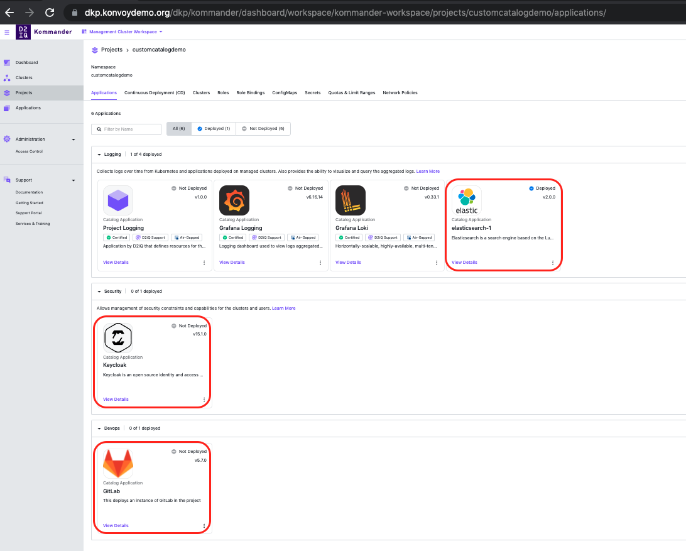

## This is a demo custom catalog repo for DKP 2.1.1 +

To add this to a project simply create a gitrepository resource as shown below to the given project

>If building your own catalog items, make sure that the image is in svg format.
>A catalog item can be designed for only projects, only workspaces or for both. This is controlled by the `scope` field in the metadata file of the service. The examples in this repo have services that can be exposed at both levels. Simply change the PROJECT variable to point to a workspace namespace to deploy to a namespace. However, note that any application that can only have one instance per cluster should only be exposed at workspace level 

```
export PROJECT=customcatalogdemo

kubectl apply -f - <<EOF
apiVersion: source.toolkit.fluxcd.io/v1beta1
kind: GitRepository
metadata:
  name: demo-project-repo
  namespace: ${PROJECT}
  labels:
    kommander.d2iq.io/gitapps-gitrepository-type: catalog
    kommander.d2iq.io/gitrepository-type: catalog
spec:
  interval: 1m0s
  ref:
    branch: master
  timeout: 20s
  url: https://github.com/arbhoj/kommander-catalog.git
EOF

``` 

Here is a screenshot of the custom catalogs in the DKP Dashboard



